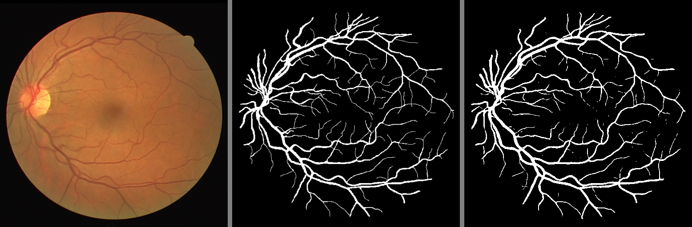
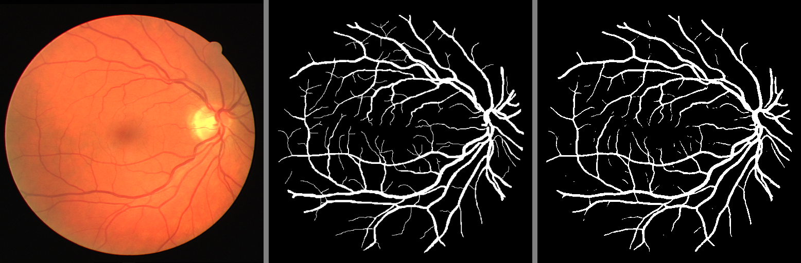
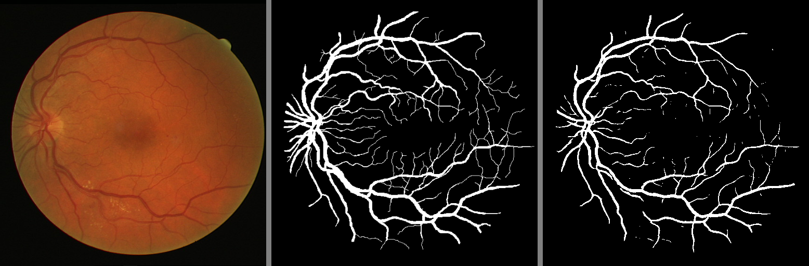
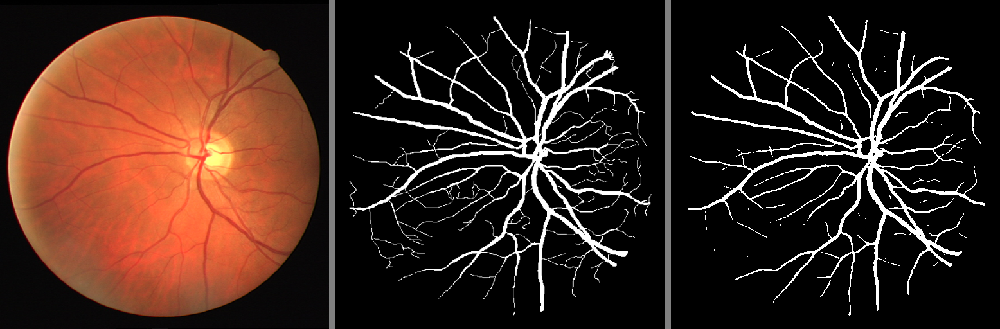

# Retinal Blood Vessel Segmentation with U-Net

A PyTorch implementation of U-Net architecture for automated retinal blood vessel segmentation in fundus images. This project provides an end-to-end solution for detecting and segmenting retinal vasculature, which is essential for diabetic retinopathy screening and ophthalmological diagnosis.

## Table of Contents

- [Overview](#overview)
- [Features](#features)
- [Project Structure](#project-structure)
- [Requirements](#requirements)
- [Installation](#installation)
- [Dataset](#dataset)
- [Usage](#usage)
- [Model Architecture](#model-architecture)
- [Training](#training)
- [Results](#results)
- [Contributing](#contributing)

## Overview

This project implements a U-Net convolutional neural network specifically designed for retinal blood vessel segmentation in fundus photography. The model automatically identifies and segments the complete retinal vascular network, including arteries and veins, from digital fundus images. This technology is crucial for early detection of diabetic retinopathy, hypertensive retinopathy, and other vascular-related eye diseases that affect millions worldwide.

## Features

- **Retinal Vessel Detection**: Precise segmentation of arteries and veins in fundus images
- **U-Net Architecture**: Complete implementation with encoder-decoder structure and skip connections
- **Custom Loss Functions**: Dice Loss and Dice-BCE Loss optimized for vessel segmentation
- **Fundus Image Processing**: Specialized preprocessing pipeline for retinal photography
- **GPU Support**: CUDA acceleration for faster training and inference
- **Model Checkpointing**: Automatic saving of best performing models
- **Clinical Evaluation**: Comprehensive metrics relevant to ophthalmological assessment

## Project Structure

```
Retinal Vessel Segmentation/
├── UNET/
│   ├── data.py              # Retinal dataset class and fundus image loading
│   ├── model.py             # U-Net architecture for vessel segmentation
│   ├── loss.py              # Custom loss functions (Dice, Dice-BCE)
│   ├── train.py             # Training script for retinal vessel detection
│   └── test.py              # Testing and inference on fundus images
├── data/
│   ├── train/               # Training retinal fundus dataset
│   │   ├── images/          # Original fundus photographs
│   │   └── mask/            # Ground truth vessel masks
│   └── test/                # Test retinal fundus dataset
│       ├── images/          # Test fundus images
│       └── mask/            # Test vessel masks
├── augmented_data/          # Augmented retinal dataset
├── results/                 # Vessel segmentation predictions
├── files/                   # Model checkpoints
├── data_augmentation.py     # Fundus image augmentation utilities
├── utils.py                 # Utility functions
└── README.md               # Project documentation
```

## Requirements

- Python 3.8+
- PyTorch 1.9+
- torchvision
- OpenCV (cv2)
- NumPy
- Matplotlib (for visualization)
- CUDA-compatible GPU (recommended)

## Installation

1. **Clone the repository:**

   ```bash
   git clone <repository-url>
   cd "Image segmentation"
   ```

2. **Create a virtual environment:**

   ```bash
   python -m venv .venv
   .venv\Scripts\activate  # On Windows
   # source .venv/bin/activate  # On Linux/Mac
   ```

3. **Install dependencies:**

   ```bash
   pip install -r requirements.txt

   # Only for CUDA enabled devices
   pip install torch torchvision torchaudio --index-url https://download.pytorch.org/whl/cu126 # Check your CUDA version
   ```

## Dataset

The project uses retinal fundus photographs with corresponding binary vessel segmentation masks. The dataset follows the standard retinal imaging format:

- **Training Images**: High-resolution RGB retinal fundus photographs (typically 512x512 or higher)
- **Training Masks**: Binary masks where white pixels indicate blood vessels and black pixels represent background
- **Test Images**: RGB retinal fundus photographs for model evaluation
- **Test Masks**: Ground truth binary vessel masks for performance assessment

[Dataset](https://www.kaggle.com/datasets/zionfuo/drive2004) - Source: Kaggle

### Fundus Image Characteristics:

- **Optic Disc**: Bright circular region where optic nerve enters the retina
- **Macula**: Central retinal region for detailed vision
- **Blood Vessels**: Arterial and venous networks radiating from optic disc
- **Background**: Retinal tissue with varying pigmentation

## 🎯 Usage

### Data Augmentation

```bash
python data_augmentation.py
```

This script generates augmented versions of the retinal fundus images to improve model robustness and generalization for vessel detection.

### Training

```bash
python UNET/train.py
```

Key training parameters:

- **Image Size**: 512x512 pixels
- **Batch Size**: 2 (adjustable based on GPU memory)
- **Learning Rate**: 1e-4
- **Epochs**: 50
- **Loss Function**: Dice-BCE Loss

### Testing/Inference

```bash
python UNET/test.py
```

This script loads the trained model and generates retinal vessel segmentation predictions on fundus test images.

## Model Architecture

### U-Net Components:

1. **Encoder (Contracting Path)**:

   - 4 encoder blocks with Conv2D + BatchNorm + ReLU
   - MaxPooling for downsampling
   - Feature channels: 64 → 128 → 256 → 512

2. **Bottleneck**:

   - ConvBlock with 1024 channels
   - Captures high-level semantic information

3. **Decoder (Expanding Path)**:

   - 4 decoder blocks with ConvTranspose2D for upsampling
   - Skip connections from corresponding encoder layers
   - Feature channels: 512 → 256 → 128 → 64

4. **Output Layer**:
   - 1x1 convolution for final segmentation map
   - Single channel output for binary segmentation

### Key Features:

- **Skip Connections**: Preserve spatial information
- **Batch Normalization**: Stable training and faster convergence
- **ReLU Activation**: Non-linear transformations

## Training

### Loss Functions:

- **Dice Loss**: Optimizes intersection over union for segmentation
- **Dice-BCE Loss**: Combines Dice loss with Binary Cross Entropy

### Optimization:

- **Optimizer**: Adam with learning rate 1e-4
- **Scheduler**: ReduceLROnPlateau for adaptive learning rate
- **Checkpointing**: Saves best model based on validation loss

### Training Process:

1. Data loading with normalization and tensor conversion
2. Forward pass through U-Net model
3. Loss calculation using Dice-BCE Loss
4. Backpropagation and parameter updates
5. Validation and model checkpointing

## Results

The trained model generates precise retinal vessel segmentation masks from fundus images. The results display images as follow:

1. Input image
2. Ground truth
3. Predicted mask

|  |
| :--------------------: |
|  |
|  |
|  |

## Contributing

1. Fork the repository
2. Create a feature branch (`git checkout -b feature/new-feature`)
3. Commit your changes (`git commit -am 'Add new feature'`)
4. Push to the branch (`git push origin feature/new-feature`)
5. Create a Pull Request

## License

This project is licensed under the MIT License - see the LICENSE file for details.

## Applications

This retinal vessel segmentation model can be applied to:

- **Diabetic Retinopathy Screening**: Automated detection of vascular abnormalities and microaneurysms
- **Hypertensive Retinopathy Assessment**: Analysis of arterial narrowing and arteriovenous nicking
- **Glaucoma Detection**: Evaluation of optic disc and peripapillary vessel changes
- **Ophthalmological Research**: Quantitative analysis of retinal vascular morphology
- **Telemedicine Platforms**: Remote screening in underserved areas
- **Clinical Decision Support**: Assisting ophthalmologists in diagnosis and treatment planning

## 🔧 Troubleshooting

### CUDA Issues:

- Ensure NVIDIA drivers are updated
- Install CUDA-enabled PyTorch version
- Check GPU compatibility: `torch.cuda.is_available()`

### Memory Issues:

- Reduce batch size in training script
- Use gradient accumulation for larger effective batch sizes
- Monitor GPU memory usage

### Performance Optimization:

- Use mixed precision training with `torch.cuda.amp`
- Implement data loading optimizations
- Consider model pruning for deployment

---

**Author**: Sounak Bhawal  
**Date**: July 2025
**Version**: 1.0
